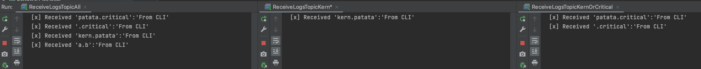

# TUTORIAL 5: TOPICS

Wonderfully explained [here](https://www.rabbitmq.com/tutorials/tutorial-five-java.html)

The logic behind the topic exchange is similar to a direct one - a message sent with a particular routing key will be
delivered to all the queues that are bound with a matching binding key. However there are two important special cases
for binding keys:

- `*` (star) can substitute for exactly one word.
- `#` (hash) can substitute for zero or more words.

You can publish a message to the exchange of this lesson like this:

```bash
rabbitmqadmin publish exchange=topic_logs routing_key=kern.patata payload="From CLI"
```

This message will match the bindings with routing key: `kern.*` and `#`, but not `*.critical`, for example:
